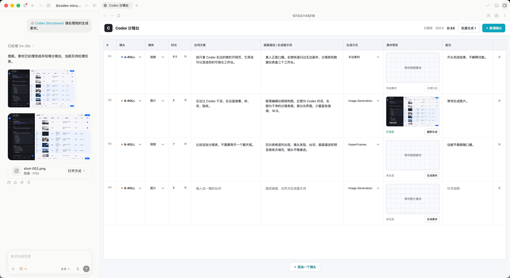

# Codex Storyboard

一个运行在本地、面向 Codex 工作流的视频分镜台。

你可以在网页里维护台词、画面提示词、A-ROLL / B-ROLL、素材类型和时长，再让 Codex 调用 Image Generation、HyperFrames 或 Remotion 生成素材并自动回填。



## 功能

- 多项目管理：新建、重命名、打开和删除项目
- Codex 可通过 MCP 一次创建完整项目和全部分镜，无需控制浏览器
- MCP 支持项目查找、读取、修改和删除
- 支持 `9:16`、`16:9`、`3:4`、`4:3`、`1:1`
- 分镜表格：台词、画面描述、时长、素材类型和生成方式
- 图片与视频本地上传
- 图片 / 视频 Lightbox 放大预览
- 单镜头生成和批量生成队列
- Codex MCP 自动领取任务并回填素材
- Image Generation、HyperFrames、Remotion 路由
- 项目级 `DESIGN.md` 视觉规范，可选导入、查看、替换和移除
- 图片和视频生成任务自动应用项目视觉规范
- 所有项目和素材默认只保存在本机

## 快速开始

需要 Node.js 18 或更高版本。

```bash
git clone https://github.com/Yuuhann1999/codex-storyboard.git
cd codex-storyboard
npm start
```

打开：

```text
http://127.0.0.1:43218
```

首次启动会自动创建本地数据目录：

```text
data/
  projects.json
  projects/
    <project-id>/
      project.json
      DESIGN.md
      media/
```

`DESIGN.md` 为可选文件，没有导入视觉规范的项目不会创建它。

## 安装 Codex 插件

仓库自带 `codex-storyboard` 插件和 Marketplace 配置。

```bash
codex plugin marketplace add Yuuhann1999/codex-storyboard
codex plugin add codex-storyboard@codex-storyboard
```

安装后重新打开 Codex 对话，然后输入：

```text
创建一个 9:16 的“Codex 侧边栏 5 种用法”分镜项目，直接写入 Codex 分镜台
```

或者处理素材生成队列：

```text
处理 Codex 分镜台里所有待生成素材
```

也可以在 Codex 中引用插件：

```text
@codex-storyboard 处理所有待生成素材
```

插件会：

1. 根据视频需求生成完整分镜，并通过一次 MCP 调用写入新项目。
2. 查找、读取、修改或删除已有项目，无需 Browser 或 Computer Use。
3. 读取本地分镜台的待处理任务。
4. 如果项目配置了 `DESIGN.md`，完整读取并作为统一视觉风格规范。
5. 根据 `generator` 选择 Image Generation、HyperFrames 或 Remotion。
6. 使用项目的画面比例和输出尺寸生成素材。
7. 将最终图片或视频回填到正确项目和镜头。

> Image Generation、HyperFrames 和 Remotion 是否可用，取决于当前 Codex 环境中已启用的能力和插件。

## 手动安装本地插件

如果你在修改插件源码，可以把当前仓库注册为本地 Marketplace：

```bash
codex plugin marketplace add .
codex plugin add codex-storyboard@codex-storyboard
```

插件源码位于：

```text
plugins/codex-storyboard/
├── .codex-plugin/plugin.json
├── .mcp.json
├── mcp/server.mjs
├── scripts/start-mcp.sh
└── skills/
    ├── manage-storyboard-projects/SKILL.md
    └── process-storyboard-tasks/SKILL.md
```

## Codex 直接创建分镜项目

插件通过 MCP 调用分镜台本地 API，不直接写 `data/`，也不使用浏览器自动化。

支持：

- 列出项目，并按标题查找
- 读取单个项目和完整镜头
- 一次创建项目、全部镜头和可选 DESIGN.md
- 修改项目名称、比例和指定镜头
- 追加或删除镜头
- 替换或移除 DESIGN.md
- 永久删除项目及其本地素材

创建工具只返回项目摘要，完整脚本不会在工具结果中重复输出，从而减少 Token 消耗。

## 画面比例

项目比例同时作用于：

- 网页素材预览框
- Image Generation 的目标比例
- HyperFrames 的画布尺寸
- Remotion 的画布尺寸
- MCP 生成任务中的 `aspectRatio`、`width` 和 `height`

## DESIGN.md 视觉规范

新建项目时可以选择导入一个 Markdown 文件作为项目视觉规范，也可以进入项目后通过右上角“视觉规范”菜单导入、查看、替换或移除。

导入后，文件统一保存为：

```text
data/projects/<project-id>/DESIGN.md
```

生成任务会同时携带该文件的绝对路径。插件生成图片或视频前会完整读取它：

- 分镜的“画面描述 / 生成提示词”决定当前镜头的具体内容
- `DESIGN.md` 统一约束视觉风格、色彩、构图、字体、质感和运动语言
- 当前镜头的明确要求与通用规范冲突时，以当前镜头要求为准
- HyperFrames 和 Remotion 的工程及中间文件保存在项目对应的 `generation/` 目录

## 本地素材

“手动素材”镜头支持：

- 点击空素材框上传
- 使用“本地上传”按钮上传
- 点击已有素材放大查看
- 在 Lightbox 中重新上传替换

支持：

- 图片：PNG、JPEG、WebP、GIF
- 视频：MP4、WebM、MOV
- 单文件最大 100MB

## 项目结构

```text
.
├── .agents/plugins/marketplace.json
├── plugins/codex-storyboard/
├── public/
├── docs/assets/
├── server.mjs
├── package.json
└── README.md
```

网页使用原生 HTML、CSS 和 JavaScript，本地服务使用 Node.js 标准库，没有运行时 npm 依赖。

## API

主要接口：

```text
GET    /api/projects
POST   /api/projects
GET    /api/projects/:projectId
PATCH  /api/projects/:projectId
DELETE /api/projects/:projectId
GET    /api/projects/:projectId/design
POST   /api/projects/:projectId/design
DELETE /api/projects/:projectId/design

POST   /api/projects/:projectId/shots
PATCH  /api/projects/:projectId/shots/:shotId
DELETE /api/projects/:projectId/shots/:shotId
POST   /api/projects/:projectId/shots/:shotId/media

GET    /api/generation/tasks
POST   /api/generation/tasks
POST   /api/generation/tasks/:taskId/claim
POST   /api/generation/tasks/:taskId/complete
POST   /api/generation/tasks/:taskId/fail
```

## 开发检查

```bash
npm run check
```

验证插件：

```bash
python3 ~/.codex/skills/.system/plugin-creator/scripts/validate_plugin.py \
  plugins/codex-storyboard
```

## 隐私

- 项目脚本和素材默认保存在本地 `data/`。
- 仓库不会自动上传项目数据。
- 使用第三方生成能力时，提示词和输入素材可能受对应服务的隐私条款约束。

## License

[MIT](LICENSE)
