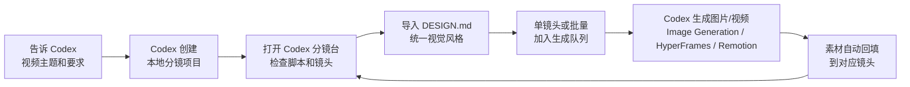
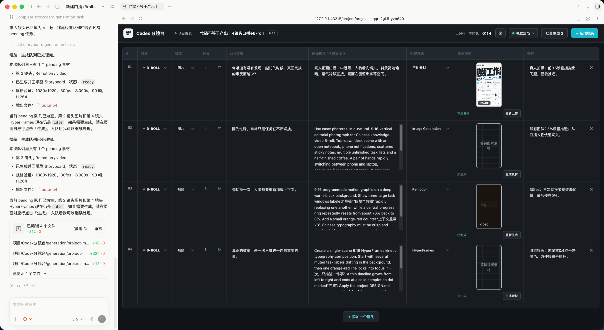
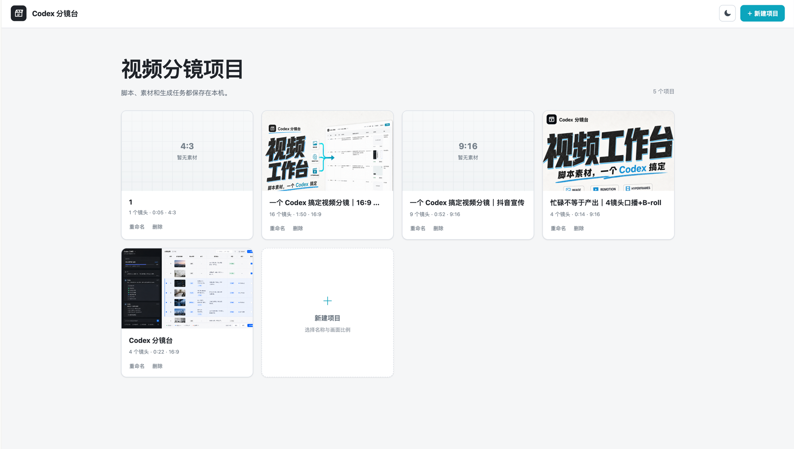
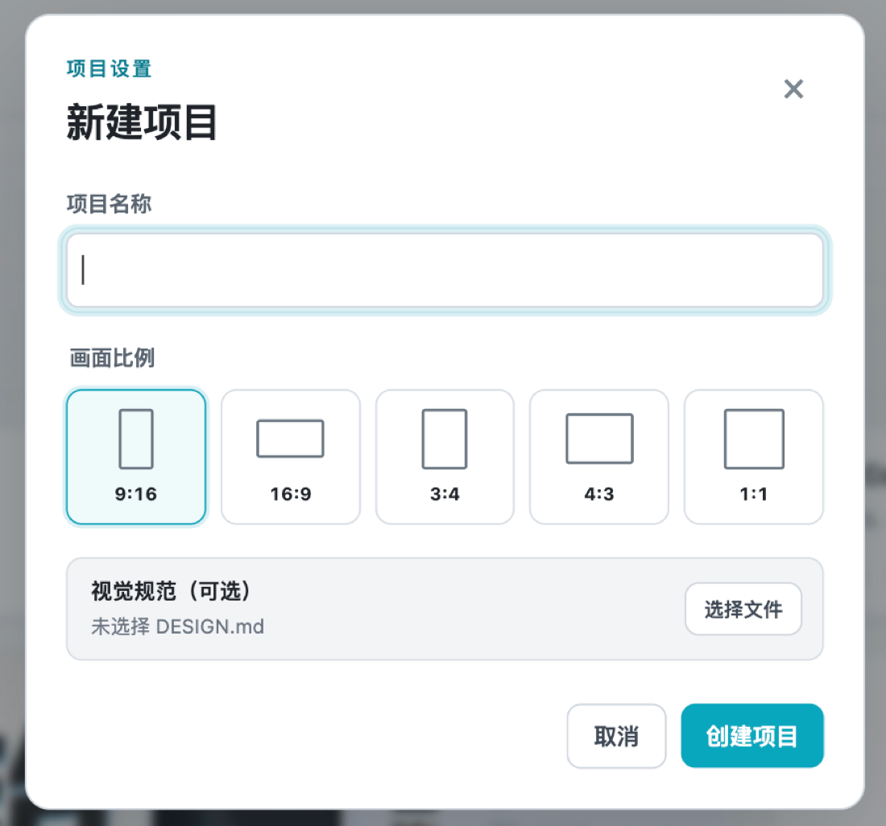
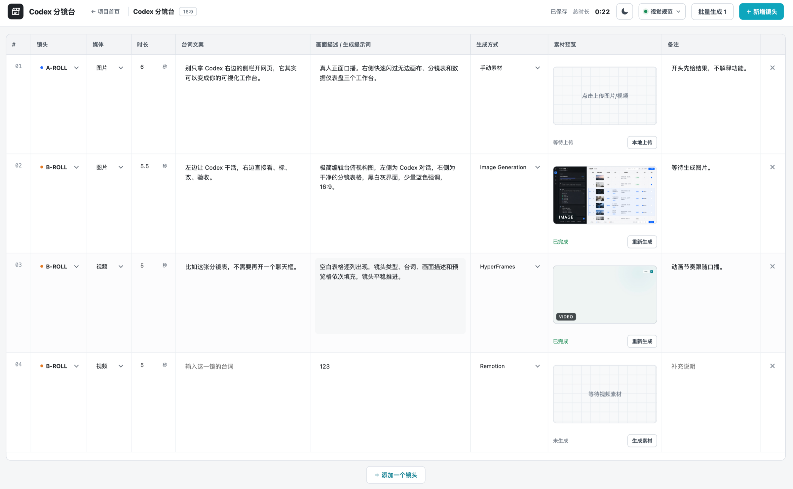
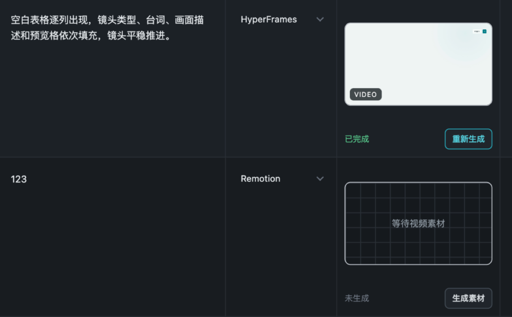

<p align="center">
  
</p>

<h1 align="center">Codex Storyboard / Codex 分镜台</h1>

<p align="center">
  安装插件后，Codex 可以直接启动本地分镜台、创建视频项目、生成图片/视频素材，并自动回填到分镜表。
</p>

<p align="center">
  <a href="./LICENSE"></a>
  
  
  
  
</p>

<p align="center">
  <a href="#快速开始">快速开始</a> ·
  <a href="#使用流程">使用流程</a> ·
  <a href="#界面展示">界面展示</a> ·
  <a href="#核心能力">核心能力</a> ·
  <a href="#designmd-视觉规范">DESIGN.md</a> ·
  <a href="#开发">开发</a> ·
  <a href="#隐私说明">隐私说明</a>
</p>

---

## 这是什么？

Codex Storyboard 是一个面向短视频和自媒体创作的本地分镜工作台。

你可以直接让 Codex 创建一个完整视频项目：镜头、台词、画面描述、A-ROLL / B-ROLL、时长、素材类型和生成方式都会写进本地分镜表。之后 Codex 还可以继续调用 Image Generation、HyperFrames 或 Remotion 生成图片 / 视频素材，并把结果回填到对应镜头。

可以把它理解成：

```text
Codex 里的视频脚本 + 分镜表 + 素材生成台。
```

普通用户不需要理解 MCP、本地 API 或文件路径。安装插件后，说一句“打开分镜台”或“帮我创建一个分镜项目”就能开始。

## 快速开始

### 1. 安装插件

需要：

- 支持插件的 Codex
- 本机可用的 Node.js 18 或更高版本

```bash
codex plugin marketplace add Yuuhann1999/codex-storyboard
codex plugin add codex-storyboard@codex-storyboard
```

安装后重启 Codex，或新开一个对话，让插件和 MCP 工具重新加载。

### 2. 打开分镜台

在 Codex 中输入：

```text
@codex-storyboard 打开 Codex 分镜台。
```

插件会自动启动内置本地工作台，并返回类似这样的链接：

```text
http://127.0.0.1:43218
```

点击链接即可在 Codex 侧边栏打开。

### 3. 创建第一个项目

```text
@codex-storyboard 创建一个 9:16 的短视频分镜项目，主题是“Codex 侧边栏的 5 种用法”，风格干净、节奏快，适合抖音。
```

项目创建后，打开分镜台刷新即可看到完整项目和镜头表。

### 4. 生成素材

在分镜台里点击单个镜头的“生成素材”，或点击“批量生成”。然后让 Codex 处理队列：

```text
@codex-storyboard 处理 Codex 分镜台里所有待生成素材。
```

> Image Generation、HyperFrames 和 Remotion 是否可用，取决于当前 Codex 环境中是否已启用对应能力或插件。

## 使用流程



一分钟日常用法：

1. 在 Codex 里说清楚视频主题、目标平台、时长和风格。
2. 让 `@codex-storyboard` 创建项目。
3. 打开本地分镜台，检查台词、画面描述和镜头时长。
4. 需要统一视觉风格时，导入项目级 `DESIGN.md`。
5. 点击“生成素材”或“批量生成”。
6. 让 Codex 处理生成队列，图片 / 视频素材会自动回填。

## 界面展示

### Codex 对话与分镜台联动



### 多项目管理



### 新建项目与画面比例



### 分镜工作台



### 素材生成与回填



## 核心能力

| 能力 | 说明 |
| --- | --- |
| 插件自带工作台 | 安装 Codex 插件后可直接启动本地分镜台，不需要单独 clone 项目。 |
| 多项目管理 | 新建、重命名、打开和删除不同视频项目。 |
| Codex 一键建项目 | 通过 MCP 直接写入项目和分镜，不需要控制浏览器。 |
| 分镜表格 | 管理镜头类型、媒体类型、时长、台词文案、画面描述、生成方式、素材预览和备注。 |
| 素材生成队列 | 支持单镜头生成和批量生成，生成完成后自动回填。 |
| 多种生成方式 | 按镜头选择手动素材、Image Generation、HyperFrames 或 Remotion。 |
| 本地素材上传 | 手动上传图片 / 视频，支持放大预览、替换和删除。 |
| 项目级 DESIGN.md | 每个项目可选导入视觉规范，用于统一图片和视频素材风格。 |
| 多画面比例 | 支持 `9:16`、`16:9`、`3:4`、`4:3`、`1:1`。 |
| 本地优先 | 项目、脚本和素材默认保存在本机。 |

## 常用提示词

打开分镜台：

```text
@codex-storyboard 打开 Codex 分镜台。
```

创建项目：

```text
@codex-storyboard 创建一个 9:16 的“AI 工具使用技巧”短视频分镜项目，直接写入 Codex 分镜台。
```

补充分镜：

```text
@codex-storyboard 帮我把这个项目补成 8 个镜头，每个镜头都写出台词、画面描述、时长和生成方式。
```

生成素材：

```text
@codex-storyboard 处理所有待生成素材。优先生成 Image Generation 图片，再生成 HyperFrames 和 Remotion 视频。
```

查找项目：

```text
@codex-storyboard 查看当前有哪些分镜项目，帮我找到标题里包含“AI 工具”的项目。
```

## DESIGN.md 视觉规范

新建项目时可以选择导入一个 Markdown 文件作为视觉规范。进入项目后，也可以通过右上角“视觉规范”菜单查看、替换或移除。

导入后，文件统一保存为：

```text
<数据目录>/projects/<project-id>/DESIGN.md
```

生成素材时：

- 分镜里的“画面描述 / 生成提示词”决定当前镜头具体内容。
- `DESIGN.md` 统一约束视觉风格、色彩、构图、字体、质感和运动语言。
- 当前镜头的明确要求与通用规范冲突时，以当前镜头要求为准。
- HyperFrames 和 Remotion 的工程及中间文件保存在项目对应的 `generation/` 目录。

## 本地数据

插件模式默认数据目录：

```text
~/.codex-storyboard/
  projects.json
  projects/
    <project-id>/
      project.json
      DESIGN.md
      media/
      generation/
```

开发模式 `npm start` 默认使用仓库内：

```text
data/
```

可以用环境变量自定义插件数据目录：

```bash
CODEX_STORYBOARD_DATA_DIR=/path/to/data
```

## Codex 插件工作流

插件通过 MCP 启动内置本地工作台，并调用本地 API。它不直接写项目 JSON，也不使用浏览器自动化强行打开页面。

支持：

- 启动或连接本地 Codex 分镜台，并返回可点击链接。
- 列出项目，并按标题查找。
- 读取单个项目和完整镜头。
- 一次创建项目、全部镜头和可选 `DESIGN.md`。
- 修改项目名称、比例和指定镜头。
- 追加或删除镜头。
- 替换或移除 `DESIGN.md`。
- 读取待处理生成任务。
- 将生成完成的图片 / 视频回填到正确镜头。
- 永久删除项目及其本地素材。

为了减少 Token 消耗，创建工具默认只返回项目摘要，不会把完整脚本文案在工具结果中重复输出。

## 本地素材

“手动素材”镜头支持：

- 点击空素材框上传。
- 使用“本地上传”按钮上传。
- 点击已有素材放大查看。
- 删除已上传或已生成的素材。
- 重新上传或重新生成。

支持格式：

- 图片：PNG、JPEG、WebP、GIF
- 视频：MP4、WebM、MOV
- 单文件最大 100MB

## 开发

如果你要修改工作台源码，可以 clone 仓库后直接启动根目录项目：

```bash
git clone https://github.com/Yuuhann1999/codex-storyboard.git
cd codex-storyboard
npm start
```

打开：

```text
http://127.0.0.1:43218
```

开发检查：

```bash
npm run check
```

验证插件：

```bash
python3 ~/.codex/skills/.system/plugin-creator/scripts/validate_plugin.py \
  plugins/codex-storyboard
```

本地调试插件：

```bash
codex plugin marketplace add .
codex plugin add codex-storyboard@codex-storyboard
```

插件源码结构：

```text
plugins/codex-storyboard/
├── .codex-plugin/plugin.json
├── .mcp.json
├── app/
│   ├── server.mjs
│   └── public/
├── mcp/server.mjs
├── scripts/start-mcp.sh
└── skills/
    ├── manage-storyboard-projects/SKILL.md
    └── process-storyboard-tasks/SKILL.md
```

项目结构：

```text
.
├── .agents/plugins/marketplace.json
├── plugins/codex-storyboard/
├── public/
├── docs/assets/
├── server.mjs
├── package.json
└── README.md
```

网页使用原生 HTML、CSS 和 JavaScript。本地服务使用 Node.js 标准库，没有运行时 npm 依赖。

主要本地 API：

```text
GET    /api/health
GET    /api/projects
POST   /api/projects
GET    /api/projects/:projectId
PATCH  /api/projects/:projectId
DELETE /api/projects/:projectId

GET    /api/projects/:projectId/design
POST   /api/projects/:projectId/design
DELETE /api/projects/:projectId/design

POST   /api/projects/:projectId/shots
PATCH  /api/projects/:projectId/shots/:shotId
DELETE /api/projects/:projectId/shots/:shotId
POST   /api/projects/:projectId/shots/:shotId/media

GET    /api/generation/tasks
POST   /api/generation/tasks
POST   /api/generation/tasks/:taskId/claim
POST   /api/generation/tasks/:taskId/complete
POST   /api/generation/tasks/:taskId/fail
```

## 隐私说明

- 插件模式下，分镜项目、脚本和素材默认保存在本地 `~/.codex-storyboard/`。
- 开发模式 `npm start` 默认使用仓库内 `data/`。
- 仓库不会自动上传项目数据。
- 本地服务默认运行在 `127.0.0.1`，优先使用端口 `43218`。
- 使用第三方生成能力时，提示词和输入素材可能受对应服务的隐私条款约束。

## License

[MIT](LICENSE)
